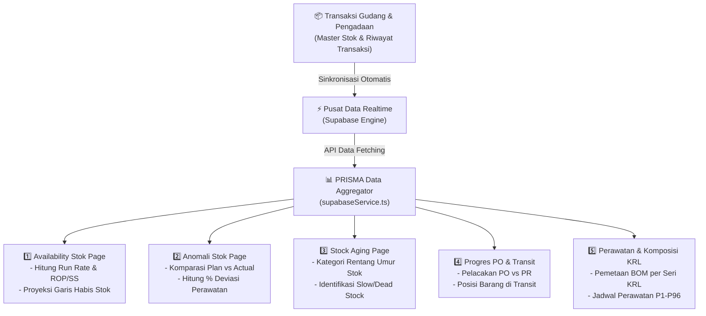

# 📘 PANDUAN EKSEKUTIF & DOKUMENTASI LENGKAP SISTEM PRISMA KRL COMMAND CENTER
*Panduan Presentasi Komprehensif: Alur Kerja Data, Pengertian Status, Rumus Matematika, dan Logika Bisnis per Halaman*

---

## 📋 DAFTAR ISI
1. [Gambaran Umum Sistem (Executive Overview)](#1-gambaran-umum-sistem-executive-overview)
2. [Aturan Bahasa UI & Glosarium Bisnis](#2-aturan-bahasa-ui--glosarium-bisnis)
3. [Penjelasan Detail Status Seluruh Sistem](#3-penjelasan-detail-status-seluruh-sistem)
4. [Alur Kerja Data End-to-End (Data Flow Architecture)](#4-alur-kerja-data-end-to-end-data-flow-architecture)
5. [Dokumentasi Detail per Halaman](#5-dokumentasi-detail-per-halaman)
   - [Halaman 1: Availability Stok (Stok Kritis & Proyeksi Penyerapan)](#halaman-1-availability-stok-stok-kritis--proyeksi-penyerapan)
   - [Halaman 2: Anomali Stok (Komparasi Rencana vs Aktual)](#halaman-2-anomali-stok-komparasi-rencana-vs-aktual)
   - [Halaman 3: Analisa Usia Stok (Stock Aging & Slow/Dead Stock)](#halaman-3-analisa-usia-stok-stock-aging--slowdead-stock)
   - [Halaman 4: Progres PO & Transit (Pelacakan Pengadaan & Pengiriman)](#halaman-4-progres-po--transit-pelacakan-pengadaan--pengiriman)
   - [Halaman 5: Perawatan KRL (BOM & Jadwal Perawatan Rangkaian)](#halaman-5-perawatan-krl-bom--jadwal-perawatan-rangkaian)
   - [Halaman 6: Komposisi Rangkaian (Pemetaan Komponen Trainset)](#halaman-6-komposisi-rangkaian-pemetaan-komponen-trainset)
   - [Halaman 7: Panel Admin & Log Audit](#halaman-7-panel-admin--log-audit)
6. [Panduan Jawaban Pertanyaan Saat Presentasi (Q&A Readiness)](#6-panduan-jawaban-pertanyaan-saat-presentasi-qa-readiness)

---

## 1. GAMBARAN UMUM SISTEM (EXECUTIVE OVERVIEW)

**PRISMA (Material Analysis & Procurement Decision Support System)** adalah sistem pusat kendali pintar (*Command Center*) berbasis data analitis yang dirancang untuk mengoptimalkan ketersediaan suku cadang (*spare parts*) armada KRL.

### Tujuan Utama Dashboard:
1. **Mencegah Train Off-Service (KRL Stambay/Gagal Jalan)** akibat kelangkaan suku cadang kritis.
2. **Memberikan Proyeksi Dini (Early Warning System)** kapan stok material akan habis hingga $N$ bulan ke depan.
3. **Mendeteksi Anomali Pemakaian**: Membandingkan rencana kebutuhan perawatan (*Plan Maintenance*) vs konsumsi riil di lapangan (*Actual Consumption*).
4. **Efisiensi Anggaran Pengadaan**: Mengidentifikasi stok mati (*Dead Stock*) dan stok lambat (*Slow Moving*) agar modal kerja tidak mengendap di gudang.

---

## 2. KAMUS KOSAKATA LENGKAP & MASTER STATUS (GLOSARIUM A - Z)

Berikut adalah kamus istilah dan seluruh kriteria status yang ada di dalam aplikasi PRISMA secara 100% komprehensif untuk persiapan menjawab pertanyaan saat presentasi:

---

### 🅰️ Status Ketersediaan Stok Material (Availability Stock Status)
- 🔴 **KRITIS**: Kondisi saldo stok fisik di gudang depo telah menyentuh atau di bawah batas **Safety Stock (SS)**, ATAU barang tersebut memiliki status PO kritis. Memiliki risiko paling tinggi menyebabkan perawatan KRL terhenti (*Train Off-Service*).
- 🟠 **WASPADA**: Kondisi saldo stok berada di antara **Safety Stock (SS)** dan **Reorder Point (ROP)**. Sinyal bahwa barang harus segera diproses pemesanan ulangnya sebelum masuk ke zona kritis.
- 🔵 **PERLU REORDER / BELUM PO**: Kondisi di mana material sudah terdeteksi di bawah batas ROP namun dokumen Pesanan Pembelian (PO) ke vendor **belum terbit** di sistem.
- 🟢 **AMAN**: Kondisi saldo stok fisik berada di atas batas **Reorder Point (ROP)** dan pengadaan lancar. Stok sangat mencukupi untuk perawatan KRL.

---

### 🅱️ Status Pemenuhan Material Perawatan (Work Order & Reservation Status)
- 🔴 **Outstanding (Defisit Stok Pemeliharaan)**: Kondisi persediaan suku cadang di gudang depo **TIDAK CUKUP** untuk memenuhi kebutuhan standar pemeliharaan (BOM) bagi KRL yang dijadwalkan servis. Berpotensi menyebabkan perawatan KRL tertunda.
- 🟢 **Fulfilled (Stok Pemeliharaan Terpenuhi)**: Kondisi persediaan suku cadang di gudang depo **CUKUP 100%** untuk mendukung proses perawatan KRL sesuai jadwal rencana tanpa hambatan.

---

### 🅲️ Status Deviasi & Anomali Penyerapan (Anomaly Deviation Status)
- 🔴 **OVER-KONSUMSI (LONJAKAN / OVER-PLAN)**: Pemakaian suku cadang di lapangan melebihi batas toleransi ($> +20\%$). Mengindikasikan adanya pemborosan material, komponen cacat, atau lonjakan akibat pemeliharaan insidentil di luar rencana.
- 🔵 **UNDER-KONSUMSI (TERTUNDA / UNDER-PLAN)**: Pemakaian suku cadang di lapangan di bawah batas toleransi ($< -20\%$). Mengindikasikan adanya penundaan pengerjaan pemeliharaan KRL di depo sehingga stok menumpuk tak terpakai.
- 🟢 **DALAM TOLERANSI (NORMAL)**: Pemakaian suku cadang berjalan wajar dan presisi sesuai standar rencana pemeliharaan ($\pm 20\%$).

---

### 🅳️ Status Kepatuhan Jadwal Perawatan KRL (Maintenance Compliance Status)
- 🟢 **TEPAT WAKTU (On-Schedule)**: Pemeliharaan KRL dilaksanakan persis pada tanggal rencana yang telah ditetapkan dalam sistem.
- 🔴 **TERLAMBAT (Overdue / Under-Plan)**: Pemeliharaan KRL belum atau terlambat dilaksanakan dari tanggal rencana yang seharusnya.
- 🟣 **INSIDENTIL (Unplanned / Over-Plan)**: Pemeliharaan KRL yang dilakukan secara darurat akibat adanya kendala teknis mendadak di jalur raya di luar jadwal rutin.

---

### 🅴️ Status Pelaksanaan Pemeliharaan (Maintenance Execution Status)
- 📋 **Rencana / Terjadwal**: Perawatan KRL baru masuk dalam daftar alokasi jadwal.
- 🛠️ **Sedang Dirawat**: KRL saat ini sedang berada di stabling/depo dalam proses pengerjaan oleh tim teknisi.
- ✅ **Selesai / Terlaksana**: Pemeliharaan KRL telah rampung 100% dan armada dinyatakan Siap Dinas (KRL Beroperasi).

---

### 🅵️ Status Alur Pengadaan Barang (Procurement Lifecycle Status)
- 📝 **Dalam Pengadaan**: Pengajuan awal suku cadang telah masuk ke dalam pipa pengadaan.
- 📄 **Proses PR & Approval**: Tahap pengajuan Permintaan Pembelian (PR) dan persetujuan anggaran internal.
- ⚖️ **Proses Evaluasi**: Tahap penilaian teknis dan harga atas penawaran vendor/pemasok.
- 📜 **Proses PO**: Tahap penerbitan dokumen Pesanan Pembelian (PO) resmi ke vendor pemenang.
- 🔍 **Goods Inspection**: Suku cadang dari vendor telah tiba dan sedang diuji kelayakan & kualitasnya oleh tim Quality Control (QC).
- 📦 **Goods Receipt (GR)**: Penerimaan fisik dan administratif resmi barang masuk ke dalam saldo gudang.

---

### 🅶️ Status Penutupan Sistem Utama (System Closure Status)
- 🔐 **CLSD (Closed) & TECO (Technically Completed)**: Penanda status transaksi di Sistem Utama yang menunjukkan bahwa proses pemeliharaan atau pengadaan telah ditutup resmi secara teknis dan finansial.

---

### 🅷️ Istilah Pergerakan Persediaan (Inventory Movement Terms)
- 🚀 **Fast Moving**: Suku cadang yang sangat aktif diserap oleh pemeliharaan KRL.
- 🐢 **Slow Moving**: Suku cadang yang mengendap di gudang tanpa ada transaksi selama 90 hingga 180 hari.
- 💀 **Dead Stock / Non-Moving**: Suku cadang yang mengendap lebih dari 365 hari (1 tahun) tanpa ada penyerapan.
- ⏱️ **Stock Aging**: Klasifikasi usia mengendap persediaan barang (0-30 hari, 31-90 hari, 91-180 hari, 181-365 hari, >365 hari).
- ⏳ **Lead Time**: Waktu tunggu pengiriman barang dari vendor sejak PO rilis hingga barang tiba di gudang.

---

### 🅸️ Istilah Lokasi Gudang Depo & Balai Yasa
- 🏢 **Gudang Transit Pusat (C013/C001)**: Gudang utama penerimaan transit barang dari vendor (area pembongkaran, bukan lokasi penyerapan perawatan).
- 🏗️ **Gudang Overhaul Manggarai (C009 / Balai Yasa)**: Lokasi pemeliharaan besar KRL (P48, P96, dan Overhaul Komponen Utama).
- 🚉 **Gudang Depo Perawatan (C006, C007, C008, C020)**: Lokasi gudang depo pemeliharaan rutin harian/bulanan KRL di Bukit Duri, Depok, Bogor, dan Manggarai.

---

### 🅹️ Istilah Komponen & Seri Rangkaian KRL
- 🚆 **Trainset / Rangkaian (SF8, SF10, SF12)**: Susunan unit kereta dalam 1 rangkaian KRL (SF = Formasi Kereta: 8, 10, atau 12 Kereta).
- 🚋 **TC (Trailer Control)**: Kereta paling depan/belakang yang memiliki kabin masinis (tanpa motor).
- ⚡ **M1 / M2 (Motor Car)**: Kereta tengah penggerak utama yang dilengkapi motor listrik traksi.
- 🛞 **Brake Shoe (Blok Rem)**: Balok rem gesek penahan roda KRL.
- 🔌 **Carbon Brush (Integrated Contact Strip)**: Karbon penghantar listrik dari kawat atas (LAA) melalui pantograf.
- ⚙️ **Pantograph**: Lengan pengambil arus listrik aliran atas di atap KRL.
- 🔄 **Traction Motor (Motor Traksi)**: Motor listrik penggerak roda KRL.
- 🔧 **Tingkat Perawatan P1 - P96**: Hirarki perawatan rutin KRL (P1=Bulanan, P3=3 Bulan, P6=6 Bulan, P12=1 Tahun, P24=2 Tahun, P48=4 Tahun, P96=8 Tahun).

---

## 3. PENJELASAN DETAIL STATUS SELURUH SISTEM

Setiap status indikator di PRISMA memiliki kriteria matematis yang baku untuk memastikan konsistensi 100% antara KPI Card, Donut Chart, dan Tabel Data:

### A. Status Ketersediaan Stok Material (Availability Stock Status)

```
                       Current Stock Level
┌──────────────────────────────────────────────────────────────┐
│  🔴 KRITIS      │   🟠 WASPADA    │  🔵 REORDER │   🟢 AMAN   │
└─────────────────┴─────────────────┴─────────────┴────────────┘
0              Safety Stock        Reorder Point            Stok Cukup
                 (SS)                 (ROP)
```

1. 🔴 **KRITIS (Critical)**
   - **Kriteria**: `Stok Saat Ini ≤ Safety Stock (SS)` ATAU `Status PO == 'KRITIS'`.
   - **Arti Bisnis**: Stok berada di bawah batas aman minimum. Berisiko tinggi menyebabkan perawatan KRL terhenti dalam waktu dekat jika tidak ada pengiriman pasokan.
   - **Tindakan**: Prioritas tinggi ekspedisi PO atau percepatan penerimaan barang dari vendor.

2. 🟠 **WASPADA (Warning)**
   - **Kriteria**: `Safety Stock < Stok Saat Ini ≤ Reorder Point (ROP)` ATAU `Status PO == 'WASPADA'`.
   - **Arti Bisnis**: Stok sudah melewati titik pemesanan ulang (*Reorder Point*), namun belum menyentuh batas kritis dasar.
   - **Tindakan**: Siapkan pengajuan PO baru atau koordinasi kelancaran vendor.

3. 🔵 **PERLU REORDER / BELUM PO (Reorder Required)**
   - **Kriteria**: `Status PO == 'BELUM PO'` (Material yang belum memiliki nomor Pesanan Pembelian aktif).
   - **Arti Bisnis**: Barang sudah dibutuhkan untuk pemeliharaan, namun dokumen pemesanan pembelian (PO) belum terbit di sistem.
   - **Tindakan**: Tim pengadaan harus segera menerbitkan PO ke vendor terkait.

4. 🟢 **AMAN (Safe)**
   - **Kriteria**: `Stok Saat Ini > Reorder Point (ROP)` dan PO berstatus lancar.
   - **Arti Bisnis**: Saldo stok mencukupi untuk memenuhi seluruh kebutuhan perawatan KRL sesuai rencana operasional.
   - **Tindakan**: Pemantauan rutin biasa.

---

### B. Status Penyerapan / Konsumsi Material (Consumption Trend Status)

1. 🚀 **FAST MOVING (Penyerapan Cepat)**
   - **Kriteria**: Rata-rata konsumsi bulanan melebihi batas rata-rata riwayat ($> 120\%$ dari standar).
   - **Arti Bisnis**: Material sangat aktif digunakan dalam pemeliharaan KRL.

2. 🐢 **SLOW MOVING (Penyerapan Lambat)**
   - **Kriteria**: Tidak ada transaksi pengeluaran barang selama $> 90$ hari hingga $180$ hari.
   - **Arti Bisnis**: Barang mengendap terlalu lama, perlu peninjauan ulang kuota pengadaan.

3. 💀 **DEAD STOCK / NON-MOVING (Stok Mati)**
   - **Kriteria**: Tidak ada transaksi pengeluaran barang selama $> 365$ hari (1 tahun).
   - **Arti Bisnis**: Modal kerja terikat pada barang yang tidak terpakai. Potensi pembatalan pengadaan selanjutnya.

---

### C. Status Anomali Penyerapan (Anomaly Analysis Status)

1. 🔴 **ANOMALI (Over-Plan / Under-Plan Deviation)**
   - **Kriteria**: `Persentase Deviasi > +20%` (Insidentil/Pemborosan) ATAU `Persentase Deviasi < -20%` (Penundaan Perawatan).
   - **Arti Bisnis**: Pemakaian riil di lapangan menyimpang jauh dari standar pemeliharaan resmi (BOM).

2. 🟢 **NORMAL (In-Plan)**
   - **Kriteria**: `-20% ≤ Persentase Deviasi ≤ +20%`.
   - **Arti Bisnis**: Pemakaian material berjalan sesuai dengan perencanaan dan standar perawatan rutin.

---

## 4. ALUR KERJA DATA END-TO-END (DATA FLOW ARCHITECTURE)



### Penjelasan Cara Perhitungan & Contoh Angka Riil:

1. **Rata-rata Penyerapan Bulanan (Run Rate)**:
   - **Penjelasan**: Total barang yang terpakai selama beberapa bulan terakhir dibagi dengan jumlah bulan tersebut.
   - **Contoh Angka**: Jika dalam 6 bulan terakhir total pemakaian barang adalah 120 unit, maka Rata-rata Penyerapan Bulanan adalah **120 dibagi 6 = 20 unit per bulan**.

2. **Batas Pemesanan Ulang (Reorder Point / ROP)**:
   - **Penjelasan**: Jumlah stok minimal di mana sistem harus memberi peringatan untuk memesan ulang. Dihitung dari (Rata-rata Penyerapan Bulanan dikali Waktu Tunggu Pengiriman) ditambah Stok Pengaman Minimum.
   - **Contoh Angka**: Jika pemakaian bulanan = 20 unit, waktu tunggu pengiriman vendor = 2 bulan, dan Stok Pengaman = 10 unit, maka Batas Pemesanan Ulang adalah **(20 x 2) + 10 = 50 unit**.

3. **Stok Pengaman Minimum (Safety Stock / SS)**:
   - **Penjelasan**: Cadangan stok darurat untuk mengantisipasi keterlambatan vendor atau lonjakan pemakaian insidentil. Dihitung dari Rata-rata Penyerapan Bulanan dikali Buffer Waktu Darurat.
   - **Contoh Angka**: Jika pemakaian bulanan = 20 unit dan buffer darurat diset 0.5 bulan (2 minggu), maka Stok Pengaman Minimum adalah **20 x 0.5 = 10 unit**.

4. **Proyeksi Tanggal Stok Habis (Bulan Habis)**:
   - **Penjelasan**: Perkiraan bulan kapan barang akan habis total jika pemakaian berjalan stabil. Dihitung dari Bulan Saat Ini ditambah dengan hasil pembagian Stok Fisik Saat Ini dibagi Rata-rata Penyerapan Bulanan.
   - **Contoh Angka**: Jika saat ini bulan Juli 2026, stok fisik tersisa 80 unit, dan pemakaian bulanan = 20 unit, maka barang akan habis dalam **80 dibagi 20 = 4 bulan ke depan (yaitu bulan November 2026)**.

5. **Persentase Deviasi Anomali Pemakaian**:
   - **Penjelasan**: Mengukur seberapa jauh pemakaian aktual di lapangan menyimpang dari rencana standar pemeliharaan resmi. Dihitung dari (Aktual Pemakaian - Rencana Pemeliharaan) dibagi Rencana Pemeliharaan, lalu dikali 100 persen.
   - **Contoh Angka**: Jika rencana perawatan membutuhkan 10 unit barang tetapi riil di lapangan terpakai 15 unit, maka deviasinya adalah **((15 - 10) dibagi 10) x 100% = +50% (Terjadi Anomali Pemborosan/Pemakaian Ekstra sebesar 50%)**.

---

## 5. DOKUMENTASI DETAIL PER HALAMAN

---

### Halaman 1: Availability Stok (Stok Kritis & Proyeksi Penyerapan)
*File Utama: `src/pages/CriticalStockPage.tsx`*

#### 🎯 Fungsi Utama:
Memantau tingkat kecukupan stok material kritis di seluruh depo dan memproyeksikan secara visual garis tanggal kapan stok akan habis (*Depletion Timeline*).

#### 📊 Elemen UI & Indikator:
1. **4 KPI Cards (Interactive Filter)**:
   - **Status Kritis**: Jumlah material dengan `Stok ≤ SS`. (Klik untuk filter tabel).
   - **Status Waspada**: Jumlah material dengan `SS < Stok ≤ ROP`.
   - **Status Aman**: Jumlah material dengan `Stok > ROP`.
   - **Perlu Reorder**: Jumlah material yang `Belum Terbit PO`.
2. **Grafik Proyeksi Penyerapan (ECharts Area Chart)**:
   - **Garis Biru Solid**: Realisasi pemakaian aktual historis.
   - **Garis Oranye Putus-Putus**: Proyeksi penyerapan terhitung berdasarkan *Run Rate*.
   - **Garis Vertikal Merah (Stok Habis)**: Tanda indikator otomatis pada bulan stok mencapai 0.
3. **Pie Donut Chart (Status Distribusi)**:
   - Menampilkan proporsi visual komposisi Kritis, Waspada, Reorder, dan Aman secara real-time.
4. **Tabel Analisis Stok Kritis**:
   - Menampilkan daftar material lengkap beserta persentase ketersediaan, sisa stok, ROP, SS, dan status PO.

---

### Halaman 2: Anomali Stok (Komparasi Rencana vs Aktual)
*File Utama: `src/pages/AnomalyStockPage.tsx`*

#### 🎯 Fungsi Utama:
Mendeteksi ketidaksesuaian (*deviasi*) antara rencana perawatan resmi KRL dengan pengeluaran fisik barang di depo.

#### 📊 Elemen UI & Indikator:
1. **Insight Kepatuhan Perawatan (Banner Top)**:
   - Menampilkan persentase kepatuhan rata-rata (contoh: `67%`) dan jumlah perawatan tepat waktu vs terlambat/insidentil.
2. **Grafik Komparasi Rencana vs Aktual**:
   - Membandingkan tren garis rencana pemeliharaan (BOM Standard) dengan realisasi aktual penyerapan material.
3. **Tombol Ikon Deviasi & Filter Gudang**:
   - Memungkinkan pengguna mengaktifkan/mematikan area deviasi visual dan menyaring berdasarkan gudang depo tertentu.
4. **Sunburst Chart / Donut Perbandingan Anomali Gudang**:
   - Menampilkan sebaran lokasi depo mana yang menyumbang anomali terbanyak.

---

### Halaman 3: Analisa Usia Stok (Stock Aging & Slow/Dead Stock)
*File Utama: `src/pages/StockAgingPage.tsx`*

#### 🎯 Fungsi Utama:
Menganalisis umur simpan persediaan barang di gudang untuk mencegah penurunan kualitas barang dan penumpukan modal kerja.

#### 📊 Elemen UI & Indikator:
1. **Ringkasan Umur Barang (Aging Bracket)**:
   - **0 - 30 Hari**: Stok Baru (Sangat Sehat).
   - **31 - 90 Hari**: Stok Normal.
   - **91 - 180 Hari**: Fast/Slow Moving Alert.
   - **181 - 365 Hari**: Slow Moving (Perlu Evaluasi).
   - **> 365 Hari**: Dead Stock / Non-Moving (🔴 Riskan).
2. **Total Nilai Stok Terikat**:
   - Menghitung estimasi nilai rupiah stok yang mengendap pada kategori Slow/Dead Stock.

---

### Halaman 4: Progres PO & Transit (Pelacakan Pengadaan & Pengiriman)
*File Utama: `src/pages/POProgressPage.tsx`*

#### 🎯 Fungsi Utama:
Melacak status pengadaan suku cadang mulai dari terbitnya Permintaan Pembelian (PR), Pesanan Pembelian (PO), hingga posisi pengiriman barang di transit (*In-Transit*).

#### 📊 Elemen UI & Indikator:
1. **Tahapan Pipeline Pengadaan**:
   - `PR Terbit` $\rightarrow$ `PO Rilis` $\rightarrow$ `Proses Produksi Vendor` $\rightarrow$ `Barang Dikirim (Transit)` $\rightarrow$ `Diterima Gudang Transit Pusat` $\rightarrow$ `Distribusi ke Depo`.
2. **Tabel Tracking PO & Transit**:
   - Menampilkan nomor PO, nama vendor, tanggal perkiraan tiba (ETA), jumlah pesanan, dan status pengiriman real-time.

---

### Halaman 5: Perawatan KRL (BOM & Jadwal Perawatan Rangkaian)
*File Utama: `src/pages/MaintenanceKRLPage.tsx`*

#### 🎯 Fungsi Utama:
Mengelola Master Bill of Materials (BOM) pemeliharaan KRL dan menyelaraskan jadwal pemeliharaan rutin (*Preventive Maintenance*) dengan ketersediaan suku cadang.

#### 📊 Elemen UI & Indikator:
1. **Tingkatan Perawatan KRL**:
   - **P1, P3, P6, P12**: Perawatan Rutin Bulanan di Depo.
   - **P24, P48, P96**: Perawatan Besar (Overhaul / Mid-Life Overhaul) di Gudang Overhaul Manggarai.
2. **Tabel Kebutuhan Standar Suku Cadang (BOM)**:
   - Menampilkan kebutuhan komponen per tipe perawatan per kereta (TC, M1, M2).

---

### Halaman 6: Komposisi Rangkaian (Pemetaan Komponen Trainset)
*File Utama: `src/pages/TrainCompositionPage.tsx`*

#### 🎯 Fungsi Utama:
Visualisasi hierarki susunan kereta dalam satu rangkaian (*Trainset SF8, SF10, SF12*) dan pemetaan lokasi pemasangan komponen utama (seperti *Brake Shoe*, *Pantograph*, *Traction Motor*, *Wiper*).

---

### Halaman 7: Panel Admin & Log Audit
*File Utama: `src/pages/AdminPanelPage.tsx` & `src/pages/AuditLogPage.tsx`*

#### 🎯 Fungsi Utama:
1. **Panel Admin**: Pengaturan ambang batas (*Threshold Settings*), bobot toleransi anomali, serta jadwal perawatan armada KRL.
2. **Log Audit**: Pencatatan jejak aktivitas (*Audit Trail*) pengguna dalam mengubah parameter atau memperbarui data sistem untuk keamanan & transparansi.

---

## 6. PANDUAN JAWABAN PERTANYAAN SAAT PRESENTASI (Q&A READINESS)

### ❓ Q1: "Mengapa Gudang Pusat (C013) tidak dihitung dalam grafik penyerapan stok kritis?"
> **Jawaban**: *"Gudang Pusat (C013/C001) berfungsi sebagai tempat penerimaan transit awal barang dari vendor, bukan lokasi pemakaian/konsumsi perawatan KRL. Penyerapan fisik suku cadang secara nyata terjadi di Gudang Depo (Depok, Bukit Duri, Manggarai, Bogor) dan Gudang Overhaul Manggarai. Mengikutkan Gudang Pusat akan membiasakan data ketersediaan barang di lapangan."*

### ❓ Q2: "Bagaimana cara sistem mengetahui kapan stok material akan habis?"
> **Jawaban**: *"Sistem menghitung rata-rata kecepatan penyerapan riil (Run Rate) dalam beberapa bulan terakhir. Selanjutnya, saldo stok fisik saat ini dibagi dengan Run Rate bulanan tersebut. Hasilnya ditransformasikan secara presisi menjadi tanggal proyeksi stok habis (Garis Merah Vertikal pada Grafik)."*

### ❓ Q3: "Mengapa jumlah di KPI Card, Donut Chart, dan Tabel selalu sama?"
> **Jawaban**: *"PRISMA menggunakan rumus penentu status tunggal (Single Source of Truth) berdasarkan batasan baku Safety Stock (SS), Reorder Point (ROP), dan Status PO. Seluruh komponen UI membaca fungsi terpusat yang sama sehingga dijamin 100% konsisten."*

---
*Dokumen ini dibuat otomatis sebagai panduan resmi presentasi sistem PRISMA KRL Command Center.*
